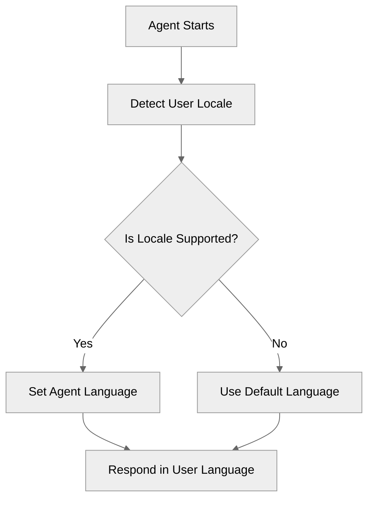

# LanguageSettings

## Overview

Learn how to configure **language settings** for your agent to support multiple locales.

## Agent Flow



## Key Concepts

- **Language Block**: Configures the primary and additional supported locales.
- **Locale Awareness**: The agent automatically detects and adapts to the supported locales.

## How It Works

### Language Block Configuration

The `language` block in the agent file defines which languages the agent can speak and understand.

## Key Code Snippets

### Language Configuration

```agentscript
language:
   default_locale: "en_US"                 # Default/Primary locale
   additional_locales: "es_MX,fr,de"       # Comma-separated list of supported locales
   all_additional_locales: False           # Restrict to only listed locales
```

## Try It Out

### Example Interaction

```text
User: Hola

Agent: Hola. Puedo ayudarte en español.
```

## What's Next

- **CustomerServiceAgent**: Build a full customer service agent using multiple languages.
