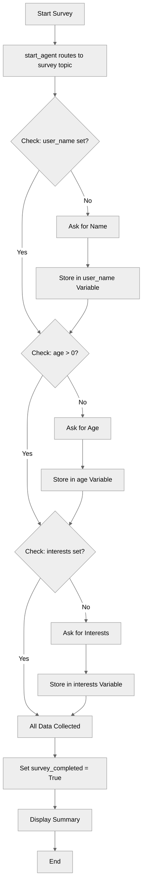

# VariableManagement

## Overview

This recipe demonstrates how to use variables to manage state in your agent. Variables allow agents to remember information across conversation turns, track progress, and maintain context throughout an interaction.

## Agent Flow



## Key Concepts

- **Variables block**: Where all agent state is defined
- **Variable types**: string, number, boolean, object
- **Mutable variables**: Can be changed by the agent during conversation
- **Linked variables**: Read-only values from external context
- **Default values**: Initial state for variables
- **Variable descriptions**: Document purpose for developers and LLM
- **Accessing variables**: Using `@variables.variable_name` syntax
- **Template expressions**: Using `{!@variables.name}` in instructions

## How It Works

### The Variables Block

All variables are defined in a global `variables` block:

```agentscript
variables:
   user_name: mutable string = ""
      description: "The user's full name"

   age: mutable number = 0
      description: "The user's age in years"
```

Variables defined here are accessible from any topic in your agent using `@variables.variable_name`.

### Variable Types

Agent Script supports several core types:

#### String Variables

```agentscript
user_name: mutable string = ""
   description: "The user's full name"
```

- Stores text values
- Default value: `""` (empty string)
- Use for: names, descriptions, identifiers, free-form text

#### Number Variables

```agentscript
age: mutable number = 0
   description: "The user's age in years"
```

- Stores numeric values (integers or decimals)
- Default value: `0`
- Use for: counts, ages, prices, quantities, calculations

#### Boolean Variables

```agentscript
survey_completed: mutable boolean = False
   description: "Whether the user has completed all survey questions"
```

- Stores true/false values
- Default value: `False`
- Use for: flags, status indicators, completion tracking
- **Important**: Use `True` and `False` (capitalized, Python-style)

### Mutable vs. Linked Variables

#### Mutable Variables

```agentscript
user_name: mutable string = ""
   description: "The user's full name"
```

- **Can be changed** by the agent
- Marked with `mutable` keyword
- Agent can `set` these values during execution
- Use for: data the agent collects or computes

### Variable Descriptions

```agentscript
user_name: mutable string = ""
   description: "The user's full name"
```

Descriptions serve two purposes:

1. **Documentation**: Explain what the variable stores
2. **LLM understanding**: Help the agent understand when and how to use the variable

### Accessing Variables in Instructions

Use the `@variables.` prefix to access variables, and `{!...}` for template interpolation:

```agentscript
reasoning:
   instructions:->
      if @variables.user_name:
         | - Name: {!@variables.user_name}
      else:
         | - Name: Not provided
```

Variables can be accessed:

- In template expressions with `{!@variables.name}`
- In conditionals: `if @variables.age > 0:`
- When setting values: `set @variables.name = "value"`

## Key Code Snippets

### Complete Variables Block

```agentscript
variables:
   user_name: mutable string = ""
      description: "The user's full name"

   age: mutable number = 0
      description: "The user's age in years"

   survey_completed: mutable boolean = False
      description: "Whether the user has completed all survey questions"

   interests: mutable string = ""
      description: "List of the user's interests and hobbies"
```

### Using Variables in Procedural Instructions

```agentscript
reasoning:
   instructions:->
      |
        Collect information from the user step by step.

        Current survey progress:
      if @variables.user_name:
         | - Name: {!@variables.user_name}
      else:
         | - Name: Not provided

      if @variables.age > 0:
         | - Age: {!@variables.age}
      else:
         | - Age: Not provided

      if @variables.interests:
         | - Interests: {!@variables.interests}
      else:
         | - Interests: Not provided

      | - Survey complete: {!@variables.survey_completed}
```

### Conditional Logic Based on Variables

```agentscript
if @variables.user_name:
   | - Name: {!@variables.user_name}
else:
   | - Name: Not provided
```

The `if/else` blocks control which template content is included based on variable values.

### start_agent Entry Point

```agentscript
start_agent topic_selector:
   description: "Welcome users and begin the survey process"

   reasoning:
      actions:
         begin_survey: @utils.transition to @topic.survey
            description: "Start collecting user information through the survey"
            available when @variables.survey_completed == False
```

## Try It Out

Here's how a conversation with this agent might flow:

### Example Interaction

```text
Agent: Welcome! I'd like to learn a bit about you. Let's start with your name.

User: My name is Alex

Agent: Nice to meet you, Alex! How old are you?

User: I'm 28

Agent: Thanks, Alex! What are some of your interests or hobbies?

User: I enjoy hiking, photography, and cooking

Agent: That's wonderful! Thank you for sharing, Alex. I've recorded:
       - Name: Alex
       - Age: 28
       - Interests: hiking, photography, cooking

       Your survey is now complete!
```

Behind the scenes, the agent is tracking:

- `user_name = "Alex"`
- `age = 28`
- `interests = "hiking, photography, cooking"`
- `survey_completed = True`

## Variable Best Practices

### Naming

- Use descriptive names: `user_email` not `email`
- Use snake_case: `first_name` not `firstName`
- Keep within 80 characters
- Only use letters, numbers, and underscores

### Descriptions

- Write clear, specific descriptions
- Explain what the variable stores
- Mention any constraints or formats
- These help both developers and the LLM

### Default Values

- Always provide sensible defaults for mutable variables
- Empty string `""` for text not yet collected
- `0` for numbers not yet known
- `False` for boolean flags

### Types

- Choose the simplest type that works
- Use `string` for most text
- Use `boolean` for yes/no flags

## What's Next?

This recipe shows how to declare and reference variables in instructions. To learn how to modify variables programmatically:

- **ActionDefinitions**: Learn about actions that capture outputs into variables
- **ActionCallbacks**: Use `set @variables.name = @outputs.value` to store action results
- **ReasoningInstructions**: Use the `set` keyword in procedural instructions

## Notes

- Variables are **global** within an agent - all topics can access all variables
- Variable names follow the same rules as agent names (letters, numbers, underscores only)
- Variables persist across conversation turns within the same session
- The `@` symbol is required when accessing resources like `@variables`, `@actions`, `@topic`
